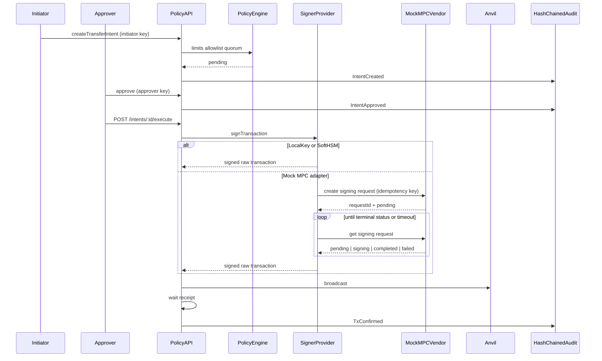

# Policy-Custody-Signer

[](https://github.com/0xCooki/Policy-Custody-Signer/actions)
[](https://www.typescriptlang.org/)
[](https://nodejs.org/)
[](./LICENSE)

Featured TypeScript Project: Policy-gated custody signer with HSM/MPC adapters, maker-checker approvals, and hash-chained audit.

---

## Architecture



Select the backend with `SIGNER_BACKEND=local|softhsm|mock-mpc`.

| Backend | What it is | Private key in app memory? |
| --- | --- | --- |
| **local** | Dev-only Anvil key from env | Yes — **DEV ONLY / UNSAFE** |
| **softhsm** | Real **PKCS#11** against SoftHSM | No — the token signs the digest |
| **mock-mpc** | HTTP adapter to a 2-of-3 **vendor simulator** | No in the API — the mock vendor signs with a labelled Anvil key after threshold |

SoftHSM is a lab stand-in for a bank HSM: production swaps the PKCS#11 `.so` for the hardware module. Mock MPC is **not** threshold cryptography; it models the integration surface (auth, idempotency, poll, timeout, terminal mapping).

---

### What a bank replaces

| Here | There |
| --- | --- |
| SoftHSM PKCS#11 module | Hardware HSM (same `SignerProvider` seam) |
| Mock MPC vendor HTTP service | Taurus / Fireblocks (or similar) async signing API |
| SQLite | Bank ledger / durable store |
| Env API keys | IdP, mTLS, request signing |
| Anvil | Permissioned or public EVM |

---

## Setup

Requires **Node 25+**, **pnpm 11+**, and **Foundry** (`anvil` on your `PATH`).

```bash
cp .env.example .env
pnpm install
```

Anvil is required for the gated signing flow, `pnpm demo`, and `pnpm test` / `pnpm test:coverage`:

```bash
# terminal A
anvil

# terminal B
pnpm test
pnpm test:coverage
pnpm lint:check
pnpm typecheck
pnpm typecheck:tests
pnpm dev
```

Health check: `GET http://localhost:3000/health`

Reset the local SQLite file: `pnpm db:reset`

### Flow

1. **Create wallet** — `admin` API key
2. **Create intent** — `initiator` API key
3. **Approve** — `approver` API key (maker ≠ checker; quorum from policy)
4. **Execute** — `approver` or `admin` — sign → match signed bytes to the intent → broadcast → confirm. The intent stays `broadcast` with `txHash` until the receipt lands. Execute refuses if that wallet already has a `broadcast` intent (`already_claimed`). An in-process lock covers claim through persist (`execution_in_progress`); it is released once hash+raw are durable so a hung RPC wait does not block reconcile. The lock is not shared across processes.
5. **Reconcile** — `admin` `POST /intents/:id/reconcile` recovers a crashed `broadcast`: rebroadcast the stored raw tx if the hash is not yet on chain, confirm from the receipt, or fail closed. Confirmed and failed intents return the stored row. A broadcast with no hash or stored raw is unclaimed back to `approved` so execute can retry (`ExecutionAborted`); persist of hash+raw is a CAS, so an in-flight execute that lost the claim will not send. Pending txs with a durable hash stay `broadcast` (`tx_pending`). After confirm or fail, `signed_raw_tx` is cleared. The signed raw tx is not returned on the API.
6. **Audit** — `admin` `GET /audit` (`{ events, verified }`; `verified` is computed on the stored chain)

Auth header: `Authorization: Bearer <key>` using keys from `.env` / `.env.example` (defaults: `dev-initiator`, `dev-approver`, `dev-admin`).

On create, `fromWalletId` must exist; then destination/value policy (`POLICY_MAX_VALUE`, `POLICY_ALLOWLIST`) is evaluated. Quorum (`POLICY_QUORUM`) is applied on approve.

`GET /intents/:id` (initiator of that intent, any approver, or admin) includes `events`: `{ id, type, payload, timestamp }` for audit rows whose payload `intentId` matches. Other initiators get the same 404 as a missing id. `actor` and chain hashes are omitted — this slice is not a verifiable chain. Admin `GET /audit` returns `{ events, verified }` where `verified` is computed server-side over the raw chain (including actor). Response events keep `prevHash` / `eventHash` and replace `actor` with `role`.

### Demo (Compose + SoftHSM)

```bash
docker compose up --build -d
pnpm demo
```

`pnpm demo` retries `GET /health` until the API is up (Compose starts the API only after Anvil is healthy). It talks to `http://127.0.0.1:$PORT` using **host** `.env` for API keys, allowlist destination, and Anvil RPC. Keep `POLICY_ALLOWLIST` in `.env` aligned with Compose (`.env.example` matches). It runs create wallet → fund signer → intent → approve → execute → audit, then prints `verified`, `auditHead` (last audit `eventHash`, not the EVM block), intent status, and `txHash`. It exits non-zero if the chain does not verify, the intent is not confirmed, or `txHash` is not a 32-byte hex hash. It also works against `pnpm dev` (LocalKey) with Anvil running.

CI runs the same script **inside** the API container (`docker compose exec api pnpm demo`) in a job separate from the live PKCS#11 signer tests, so a demo failure does not skip `pnpm test:softhsm`.

### SoftHSM (real PKCS#11)

SoftHSM keeps the private key in a PKCS#11 token (lab stand-in for a bank HSM). Production swaps the `.so` for a hardware HSM module.

Do not run `pnpm test:softhsm` while `docker compose up` is already running — both use the same SoftHSM volume, and PKCS#11 does not share a token across processes.

```bash
# Live PKCS#11 signer tests (one-shot compose run; starts Anvil itself)
pnpm test:softhsm
```

CI runs the live demo and `pnpm test:softhsm` as parallel jobs, each with its own Compose stack. Use `pnpm test:softhsm` locally when you only need the signer tests.

Or on the host: install SoftHSM2, run `./scripts/init-softhsm.sh`, export the printed `SOFTHSM_*` / `SOFTHSM2_CONF` vars, set `SIGNER_BACKEND=softhsm`.

Default `pnpm test` stays on LocalKey and skips SoftHSM live cases unless `SOFTHSM_MODULE_PATH` points at a real module.

### Mock MPC (vendor simulator)

A separate HTTP service simulates a 2-of-3 custody vendor (async request + poll). It signs with a labelled Anvil #0 **dev key** after threshold availability; it is not real threshold cryptography.

```bash
# terminal A — Anvil
anvil

# terminal B — mock vendor (default http://127.0.0.1:3001)
pnpm dev:mock-mpc

# terminal C — custody API
SIGNER_BACKEND=mock-mpc pnpm dev
```

Auth to the vendor: `Authorization: Bearer $MOCK_MPC_API_KEY` (default `dev-mpc-secret`).

All three mock participants start online (threshold 2-of-3). Take a party offline to simulate `threshold_not_met`. A later request with the same idempotency key retries once enough participants are restored:

```bash
# 1-of-3 online — the next signing request fails
curl -X PUT http://127.0.0.1:3001/v1/participants \
  -H "Authorization: Bearer dev-mpc-secret" \
  -H "content-type: application/json" \
  -d '{"available":[0]}'

# restore 2-of-3
curl -X PUT http://127.0.0.1:3001/v1/participants \
  -H "Authorization: Bearer dev-mpc-secret" \
  -H "content-type: application/json" \
  -d '{"available":[0,1]}'
```

`GET /v1/participants` returns `{ threshold, participants, available }`.
