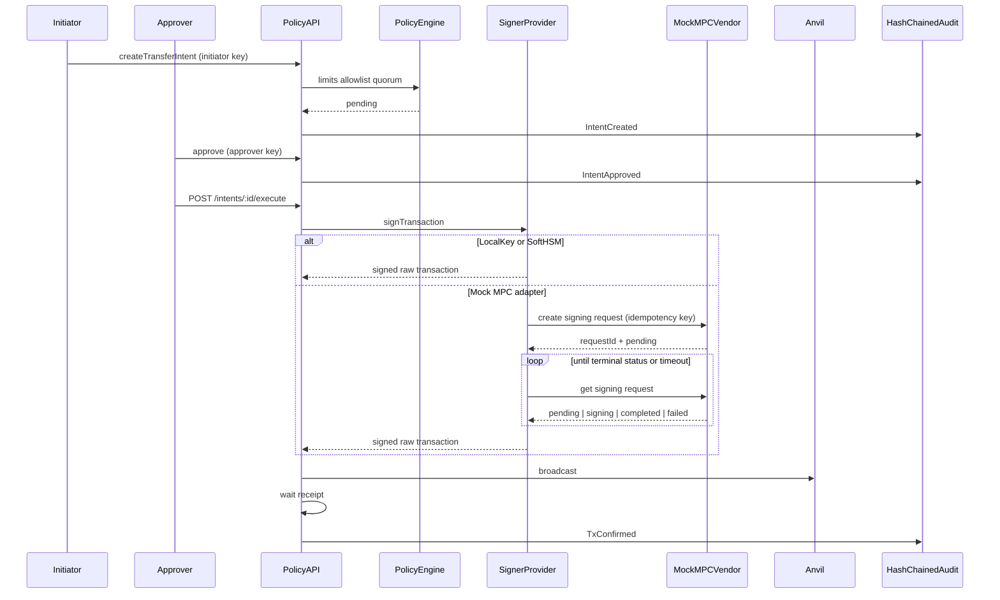

# Policy-Custody-Signer

[](https://github.com/0xCooki/Policy-Custody-Signer/actions)
[](https://www.typescriptlang.org/)
[](https://nodejs.org/)
[](./LICENSE)

Featured TypeScript Project: Policy-gated custody signer with HSM/MPC adapters, maker-checker approvals, and hash-chained audit.

---

## Architecture



Select the backend with `SIGNER_BACKEND=local|softhsm|mock-mpc`.

| Backend | What it is | Private key in app memory? |
| --- | --- | --- |
| **local** | Dev-only Anvil key from env | Yes — **DEV ONLY / UNSAFE** |
| **softhsm** | Real **PKCS#11** against SoftHSM | No — the token signs the digest |
| **mock-mpc** | HTTP adapter to a 2-of-3 **vendor simulator** | No in the API — the mock vendor signs with a labelled Anvil key after threshold |

SoftHSM is a lab stand-in for a bank HSM: production swaps the PKCS#11 `.so` for the hardware module. Mock MPC is **not** threshold cryptography; it models the integration surface (auth, idempotency, poll, timeout, terminal mapping).

---

## Setup

Requires **Node 25+**, **pnpm 11+**, and **Foundry** (`anvil` on your `PATH`).

```bash
cp .env.example .env
pnpm install
```

Anvil is required for the gated signing flow, `pnpm demo`, and `pnpm test`:

```bash
# terminal A
anvil

# terminal B
pnpm test
pnpm test:coverage
pnpm lint:check
pnpm typecheck
pnpm typecheck:tests
pnpm dev
```

Local SQLite is disposable — `pnpm db:reset` after pull (schema is not migrated in place).

### Flow

1. **Create wallet** — `admin`
2. **Create intent** — `initiator` (`POLICY_MAX_VALUE`, `POLICY_ALLOWLIST`)
3. **Approve** — `approver` (maker ≠ checker; quorum from `POLICY_QUORUM`)
4. **Execute** — `approver` or `admin` — sign, broadcast, confirm. One `broadcast` intent per wallet; run a single API instance.
5. **Reconcile** — `admin` `POST /intents/:id/reconcile` recovers a crashed `broadcast`
6. **Audit** — `admin` `GET /audit`

Auth: `Authorization: Bearer <key>` (defaults: `dev-initiator`, `dev-approver`, `dev-admin`).

### Demo (Compose + SoftHSM)

```bash
docker compose up --build -d
pnpm demo
```

Do not run `pnpm test:softhsm` while Compose is already up — both use the same SoftHSM volume.

```bash
pnpm test:softhsm
```

Or on the host: install SoftHSM2, run `./scripts/init-softhsm.sh`, export the printed `SOFTHSM_*` / `SOFTHSM2_CONF` vars, set `SIGNER_BACKEND=softhsm`. Default `pnpm test` stays on LocalKey.

### Mock MPC (vendor simulator)

```bash
# terminal A — Anvil
anvil

# terminal B — mock vendor (default http://127.0.0.1:3001)
pnpm dev:mock-mpc

# terminal C — custody API
SIGNER_BACKEND=mock-mpc pnpm dev
```

Auth to the vendor: `Authorization: Bearer $MOCK_MPC_API_KEY` (default `dev-mpc-secret`).

All three mock participants start online (threshold 2-of-3). Take a party offline to simulate `threshold_not_met`:

```bash
# 1-of-3 online — the next signing request fails
curl -X PUT http://127.0.0.1:3001/v1/participants \
  -H "Authorization: Bearer dev-mpc-secret" \
  -H "content-type: application/json" \
  -d '{"available":[0]}'

# restore 2-of-3
curl -X PUT http://127.0.0.1:3001/v1/participants \
  -H "Authorization: Bearer dev-mpc-secret" \
  -H "content-type: application/json" \
  -d '{"available":[0,1]}'
```
